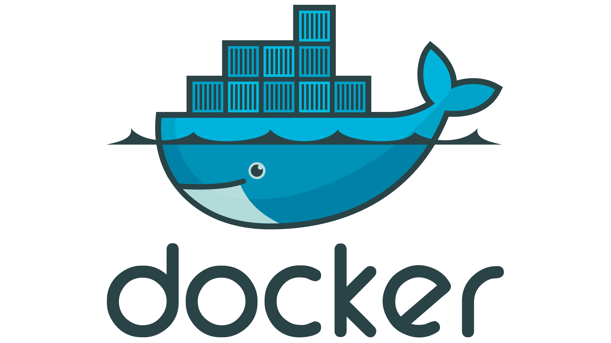

## Королев Алексей
##### Middle+ QA

* 🔥 5+ лет в тестировании
* 🐍 Пишу автотесты на Python + Playwright
* ⚙️ Развиваюсь в автоматизации
* 📑 Опыт и навыки в **[резюме](https://hh.ru/resume/cf36525cff041cd81e0039ed1f55436d687534)**
* 📞 Мои контакты: **[телеграм](https://t.me/alex_kky)**, **[почта](aakorolev91@gmail.com)**

#### Мои проекты:
| API My Shows Rating |  API Битва покемонов | UI Битва покемонов |
|---------------------|----------------------|--------------------|
|[my-shows-api-tests](https://github.com/Turlich91/myshows_api_tests)|[pokemonbattle-api-tests](https://github.com/Turlich91/pokemonbattle_api_tests)   | [pokemonbattle-e2e-tests](https://github.com/Turlich91/pokemonbattle_e2e_tests_playwright)|
| Pytest, Requests, PostgreSQL, Docker | Pytest, Requests, Gitlab CI | Playwright, Pytest, Gitlab CI |

#### Мой стек:
| Python | PyCharm | Git | Pytest | Requests | Playwright |
|--------|---------|-----|--------|----------|------------|
|  |  |  |  |  |  |

| Allure Report | PostgreSQL | Psycopg | Docker | Gitlab CI |
|---------------|------------|---------|--------|-----------|
|  |  |  |  |  |
